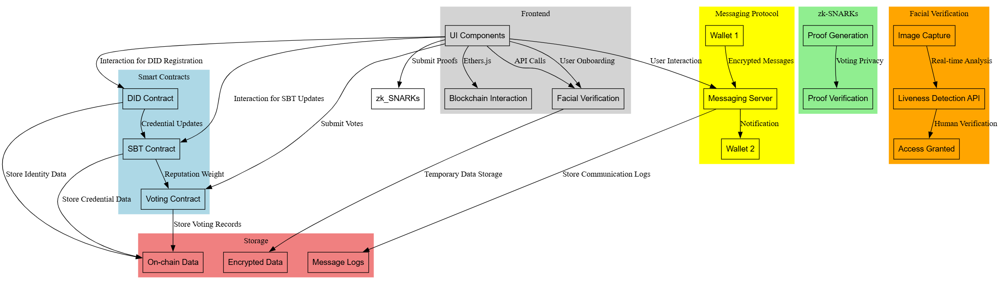

### **Decentralized Identity and Reputation System for DAOs**  
**Overview Documentation**  

---

### **1. System Objective**
The system aims to provide Decentralized Autonomous Organizations (DAOs) with a robust, privacy-preserving identity and reputation management solution. It enables DAO members to establish verifiable identities, track contributions using non-transferable credentials, vote anonymously while maintaining accountability, and communicate securely for governance purposes.  



---

### **2. Key Features**
1. **Decentralized Identity (DID):**
   - Allows DAO members to create and manage decentralized identities tied to their wallets.
   - Verifiable credentials are issued and stored securely off-chain, linked to on-chain interactions.

2. **Reputation Tracking with Soulbound Tokens (SBTs):**
   - Non-transferable tokens that represent roles, achievements, or contributions within the DAO.
   - Serve as a decentralized, immutable record of reputation.

3. **Privacy-Preserving Voting:**
   - Utilizes zk-SNARKs (Zero-Knowledge Succinct Non-Interactive Argument of Knowledge) to allow members to vote anonymously.
   - Ensures the integrity of votes without revealing individual identities.

4. **Wallet-to-Wallet Messaging:**
   - Enables secure and decentralized communication between DAO members.
   - Provides updates, alerts, and discussions related to governance or DAO activities.

5. **User-Friendly DAO Interface:**
   - A web-based platform that simplifies interactions with the system.
   - Features include identity registration, viewing credentials, voting, and messaging.

---

### **3. System Components**
1. **Identity Layer:**
   - Powered by Decentralized Identifiers (DIDs), allowing unique, cryptographic identities for DAO members.
   - Integrates standards such as DID Core for interoperability across platforms.

2. **Reputation Layer:**
   - Implements Soulbound Tokens (SBTs) as immutable, non-transferable NFTs to represent achievements and contributions.
   - Tokens are issued by the DAO based on predefined criteria or events.

3. **Privacy Layer:**
   - Leverages zk-SNARKs to provide privacy in voting and other sensitive actions.
   - Ensures the system maintains transparency without compromising anonymity.

4. **Communication Layer:**
   - Uses decentralized messaging protocols for wallet-to-wallet communication.
   - Messages are encrypted to protect sensitive information and ensure confidentiality.

5. **Governance Interface:**
   - A decentralized application (dApp) providing an accessible interface for interacting with the DAO.
   - Features include voting mechanisms, credential management, and communication tools.

---

### **4. Workflow Description**
#### **Identity Creation and Management**
1. DAO members register their wallets to generate a Decentralized Identifier (DID).
2. Verifiable credentials, such as membership status, are issued to the DID.
3. Credentials can be displayed and verified publicly without exposing private information.  

#### **Reputation Assignment**
1. Based on contributions, roles, or achievements, members are awarded Soulbound Tokens.
2. Tokens are linked to the member’s DID and stored on the blockchain.
3. These tokens are immutable and cannot be transferred, ensuring integrity.  

#### **Anonymous Voting**
1. DAO members cast votes on proposals using zk-SNARK proofs.
2. The system validates proofs without revealing voter identities.
3. Results are aggregated and displayed transparently while maintaining privacy.  

#### **Communication Workflow**
1. DAO members use wallet-to-wallet messaging to share governance-related updates.
2. Messages are routed through decentralized messaging protocols.
3. Notifications are sent for events like voting deadlines or proposal results.  

#### **User Interface Workflow**
1. Members access the DAO interface to view roles, credentials, and proposals.
2. Voting and messaging features are available through an intuitive dashboard.
3. Members can view their reputation and credentials, enhancing trust and transparency.  

---

### **5. Technologies Used**
1. **Decentralized Identity:**
   - DID standards (e.g., W3C DID Core).
   - Interoperable credential frameworks like Verifiable Credentials (VC).  

2. **Reputation Tracking:**
   - Soulbound Tokens (non-transferable NFTs adhering to ERC standards).  

3. **Privacy-Preserving Mechanisms:**
   - zk-SNARKs for zero-knowledge proofs, ensuring anonymous verification of sensitive actions.  

4. **Communication Protocols:**
   - Decentralized messaging frameworks such as XMTP for secure, encrypted wallet-to-wallet communication.  

5. **Smart Contracts:**
   - Written in Solidity to handle token issuance, voting logic, and identity storage.  

6. **Frontend Development:**
   - Responsive and accessible dApp interface for DAO interactions.  

---

### **6. Security Considerations**
1. **Identity Theft Prevention:**  
   - Private keys secure the identity layer. Compromised keys require re-registration and invalidation of old credentials.  

2. **Privacy Assurance:**  
   - zk-SNARKs protect voter anonymity and ensure that only authorized members participate.  

3. **Data Integrity:**  
   - On-chain storage for SBTs ensures that reputation data is immutable.  

4. **Messaging Security:**  
   - End-to-end encryption ensures communication confidentiality.  

---

### **7. Use Cases**
1. **DAO Membership Verification:**  
   - Authenticate members without exposing wallet addresses or other personal data.  

2. **Reputation Management:**  
   - Track contributions, roles, and achievements transparently while ensuring they cannot be transferred or forged.  

3. **Private and Secure Governance:**  
   - Enable anonymous voting to prevent undue influence or coercion while maintaining accountability.  

4. **Improved DAO Communication:**  
   - Provide a secure platform for governance updates, discussions, and real-time notifications.  

---

### **8. System Benefits**
1. **Enhanced Privacy:**  
   - zk-SNARKs ensure anonymity while maintaining verifiability.  

2. **Trust and Transparency:**  
   - Immutable Soulbound Tokens build trust within the DAO.  

3. **Decentralization:**  
   - Messaging and identity layers operate independently of centralized servers.  

4. **Ease of Use:**  
   - Intuitive interfaces simplify governance participation for all DAO members.  

---

### **9. Future Extensions**
1. **Cross-DAO Collaboration:**  
   - Enable identity and reputation portability between DAOs.  

2. **Gamification:**  
   - Introduce badges and achievements based on SBTs to incentivize participation.  

3. **AI-Driven Insights:**  
   - Analyze DAO activities using machine learning to improve governance efficiency.  

4. **Facial Verification:**  
   - Adding a facial verification system to enhance the DAO's security against bots is an excellent extension. It aligns well with the system's goals of ensuring integrity and trust. The feature could leverage decentralized storage for user data while ensuring privacy. .  


### **DiGraph Representation**

Below is the Graphviz **DiGraph** code illustrating the overview of the entire system system:

```plaintext
digraph FacialVerification {
    rankdir=LR;
    node [shape=box, fontname="Arial"];

    User [label="User (DAO Member)", shape=ellipse];
    Camera [label="Webcam/Smartphone Camera"];
    LivenessPrompts [label="Liveness Prompts"];
    LivenessAnalysis [label="Analyze Facial Movements"];
    Success [label="Access Granted"];
    Failure [label="Access Denied"];

    User -> Camera [label="Live Video Input"];
    Camera -> LivenessPrompts [label="Display Prompts"];
    LivenessPrompts -> LivenessAnalysis [label="Track Movements"];
    LivenessAnalysis -> Success [label="If Verified"];
    LivenessAnalysis -> Failure [label="If Not Verified"];
}
```
